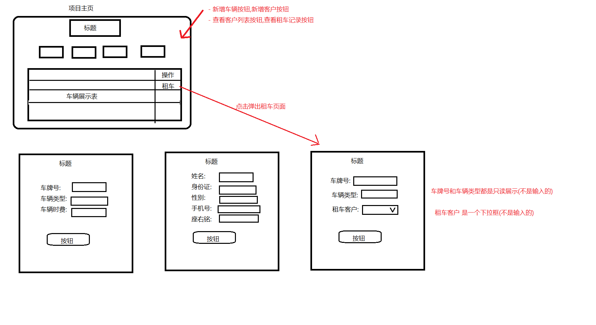

# 车辆租还系统

- 功能要求
  - 完成主页
    - 包含车辆信息表格展示(包含租车操作)
    - 新增车辆按钮,新增客户按钮
    - 查看客户列表按钮,查看租车记录按钮
  - 车辆添加
    - 车辆添加页面
    - 实现车辆添加功能
  - 客户添加
    - 客户添加页面
    - 实现客户添加功能
  - 租车
    - 租车页面
    - 实现租车功能
- 租车项目框架示意图

##### 

- 数据表

  ```sql
  CREATE TABLE `car` (
    `id` INT PRIMARY KEY AUTO_INCREMENT COMMENT '车辆主键ID',
    `card` VARCHAR(30) NOT NULL COMMENT '车牌号',
    `type` VARCHAR(50) NOT NULL COMMENT '车辆类型',
    `status` TINYINT NOT NULL DEFAULT 1 COMMENT '1空闲，0已出租',
    `price` DECIMAL(10,2) NOT NULL COMMENT '每小时租赁费用',
  ) ENGINE=InnoDB DEFAULT CHARSET=utf8mb4 COMMENT='车辆信息表';
  
  CREATE TABLE `user_info` (
    `id` INT PRIMARY KEY AUTO_INCREMENT COMMENT '客户主键ID',
    `name` VARCHAR(50) NOT NULL COMMENT '客户姓名',
    `id_card` VARCHAR(20) NOT NULL COMMENT '身份证号',
    `reg_time` DATETIME NOT NULL COMMENT '注册时间',
    `gender` VARCHAR(10) COMMENT '性别',
    `tel` VARCHAR(20) COMMENT '手机号码',
    `motto` VARCHAR(200) COMMENT '座右铭',  
  ) ENGINE=InnoDB DEFAULT CHARSET=utf8mb4 COMMENT='客户信息表';
  
  CREATE TABLE `rent_return` (
    `id` INT PRIMARY KEY AUTO_INCREMENT COMMENT '租赁记录ID',
    `car_id` INT NOT NULL COMMENT '车辆ID，外键指向car表',
    `user_id` INT NOT NULL COMMENT '客户ID，外键指向user_info',
    `rent_time` DATETIME NOT NULL COMMENT '租车时间',
    `return_time` DATETIME NULL COMMENT '还车时间，NULL代表尚未还车',
    `pay_money` DECIMAL(12,2) NOT NULL DEFAULT 0 COMMENT '应付租金',
  ) ENGINE=InnoDB DEFAULT CHARSET=utf8mb4 COMMENT='租还车记录';
  ```

  