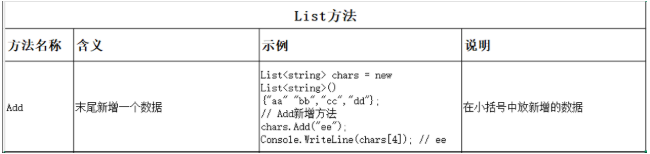

# day0 2变量和集合、随机数、数据结构

作业：整理数据字典和list集合的方法（列：方法名、含义、示例、说明）

例子：

| 方法名称        | 含义                       | 示例                                                         | 说明                                                      |
| --------------- | -------------------------- | ------------------------------------------------------------ | --------------------------------------------------------- |
| **Add**         | 末尾新增一个数据           | `csharp List<string> chars = new List<string>(){"aa","bb","cc","dd"}; chars.Add("ee"); Console.WriteLine(chars[4]); // ee` | 在小括号中放新增的数据，添加到列表末尾                    |
| **AddRange**    | 末尾批量添加一组数据       | `csharp List<int> nums = new List<int>(){1,2,3}; nums.AddRange(new int[]{4,5,6}); // nums变成 1,2,3,4,5,6` | 参数可以是数组、List 等集合，一次性添加多个元素           |
| **Insert**      | 在指定索引位置插入数据     | `csharp List<string> list = new List<string>(){"a","b","c"}; list.Insert(1, "x"); // 结果: a,x,b,c` | 两个参数：索引位置 + 要插入的数据；原位置及后面的元素后移 |
| **Remove**      | 删除第一个匹配的元素       | `csharp List<string> list = new List<string>(){"a","b","a"}; list.Remove("a"); // 结果: b,a` | 按值删除，只删找到的第一个；返回 bool 表示是否删除成功    |
| **RemoveAt**    | 删除指定索引位置的元素     | `csharp List<string> list = new List<string>(){"a","b","c"}; list.RemoveAt(0); // 结果: b,c` | 按索引删除，索引越界会报错                                |
| **RemoveAll**   | 批量删除符合条件的元素     | `csharp List<int> nums = new List<int>(){1,2,3,4,5}; nums.RemoveAll(n => n > 3); // 结果: 1,2,3` | 参数是条件（lambda 表达式），删除所有满足条件的元素       |
| **Clear**       | 清空所有元素               | `csharp List<int> nums = new List<int>(){1,2,3}; nums.Clear(); // Count = 0` | 清空列表，列表对象本身还在，只是没有元素了                |
| **Contains**    | 判断是否包含某个元素       | `csharp List<string> list = new List<string>(){"a","b","c"}; bool has = list.Contains("b"); // true` | 返回 bool，判断列表中是否存在该值                         |
| **IndexOf**     | 查找元素第一次出现的索引   | `csharp List<string> list = new List<string>(){"a","b","a"}; int idx = list.IndexOf("a"); // 0` | 找到返回索引，找不到返回 -1                               |
| **LastIndexOf** | 查找元素最后一次出现的索引 | `csharp List<string> list = new List<string>(){"a","b","a"}; int idx = list.LastIndexOf("a"); // 2` | 从后往前找，返回最后一次出现的索引                        |
| **Count**       | 获取元素个数（属性）       | `csharp List<int> nums = new List<int>(){1,2,3}; int len = nums.Count; // 3` | 注意是属性，不是方法，没有小括号                          |
| **Sort**        | 排序（默认升序）           | `csharp List<int> nums = new List<int>(){3,1,2}; nums.Sort(); // 结果: 1,2,3` | 直接修改原列表；值类型默认从小到大排序                    |
| **Reverse**     | 反转列表顺序               | `csharp List<int> nums = new List<int>(){1,2,3}; nums.Reverse(); // 结果: 3,2,1` | 把列表元素顺序倒过来                                      |
| **ToArray**     | 转成数组                   | `csharp List<int> nums = new List<int>(){1,2,3}; int[] arr = nums.ToArray();` | 将 List 转换为同类型的数组                                |
| **Find**        | 查找第一个满足条件的元素   | `csharp List<int> nums = new List<int>(){1,2,3,4,5}; int result = nums.Find(n => n > 3); // 4` | 返回第一个匹配的元素，找不到返回默认值（如 0、null）      |
| **FindAll**     | 查找所有满足条件的元素     | `csharp List<int> nums = new List<int>(){1,2,3,4,5}; List<int> result = nums.FindAll(n => n > 3); // 4,5` | 返回新的 List，包含所有满足条件的元素                     |
| **Exists**      | 判断是否存在满足条件的元素 | `csharp List<int> nums = new List<int>(){1,2,3}; bool has = nums.Exists(n => n > 5); // false` | 返回 bool，比 Find 更高效（找到就停）                     |
| **ForEach**     | 遍历每个元素执行操作       | `csharp List<int> nums = new List<int>(){1,2,3}; nums.ForEach(n => Console.WriteLine(n));` | 参数是要执行的方法，等价于 foreach 循环c                  |

