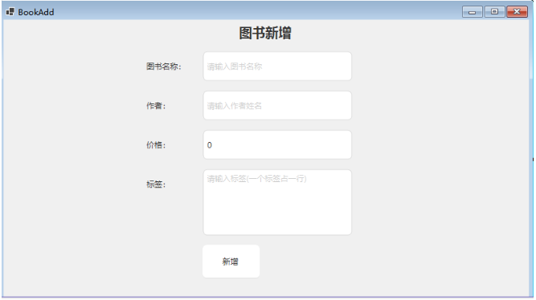

# 02winform作业

## day01  winform介绍、WinForm项目结构、控件学习、容器和控件


## day02 容器和控件、代码操作控件、事件

## day03  事件

## day04 事件、窗体操作

作业


## day05 事件、窗体操作、第三方库

作业

 二级联动中数据组织方式将原来的list改为字典 实现

```C#
  {
    ["省份"]=["城市","城市",....],
    .....    
  }
```


## day06  窗体操作、第三方库、用户控件、控件通信

作业图书新增界面



图书新增界面和编辑界面

要求:  将新增和编辑界面的公共内容提取 使用 用户控件 实现

## day07  线程操作、Task、音频播放、Mysql

## day08  Mysql

## day09  Mysql

## day10  菜单控件、文件选择和保存文件、Timer控件、数据绑定、DataGridView

## day11 文件选择和保存文件、数据绑定、DataGridView

## day12 画图

## day13  递归函数、打字游戏、Invoke、WinForm Settings 、动态链接库（DLL）

## day14  TCP通信、串口通信、ModBus

## day15  TCP通信、串口通信、ModBus

## day16  温控设备监控项目

## day17 温控设备监控项目

