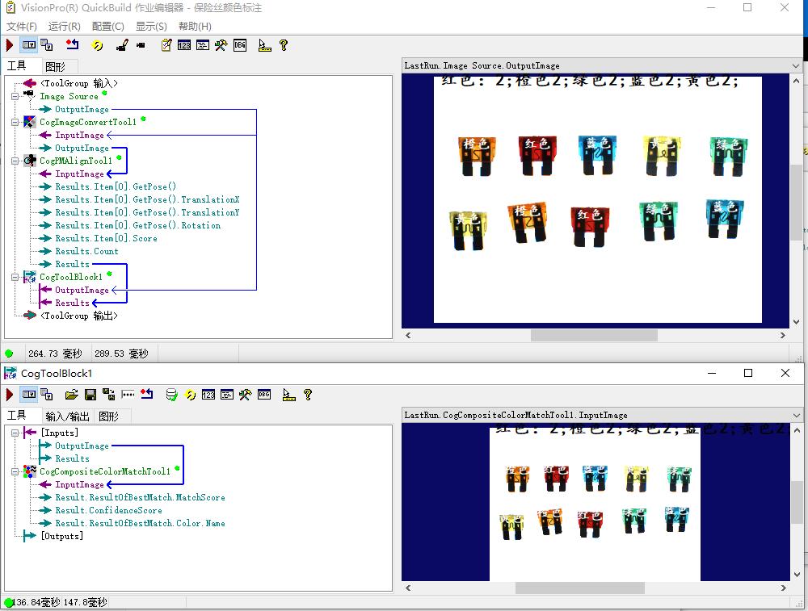
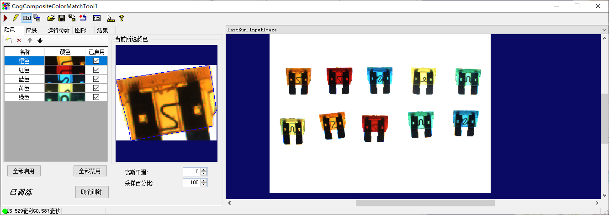
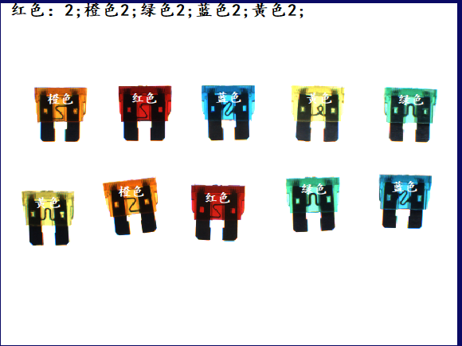
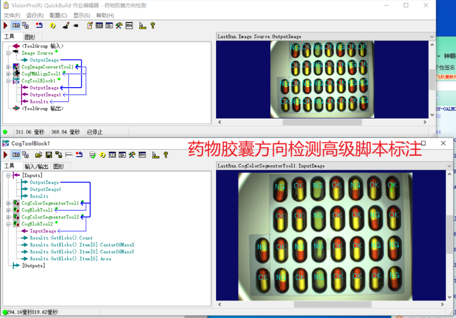
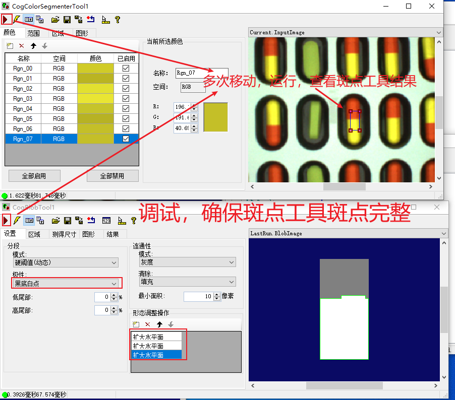
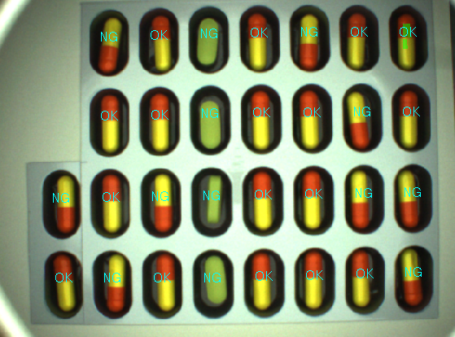

# day08视觉项目

## 01保险丝颜色统计高级脚本标注

思路：

1、工具：灰度图转换、模版匹配、使用工具块，工具块里放复合颜色匹配工具

2、需要参数：PMA（Results）

3、脚本逻辑：

遍历模版匹配结果集（姿态位置）、将姿态设置给颜色匹配工具、颜色匹配工具 执行、拿到颜色匹配结果（具体颜色）==》统计(标注颜色)

结果：

## 02药物胶囊方向检测高级脚本标注

思路

1、工具：灰度图、模版匹配、工具块（颜色分割、斑点）

注意：颜色分割工具在提取颜色时要充分考虑色差，多去样本，暗亮区别大的单独取

2、参数：PMA(Results)

3、脚本逻辑：

获取:工具（ColorSeg、Blob、PMA）、工具的区域（PMA）、PMA参数（Results）

遍历:PMA参数（Results）>>设置颜色提取工具的区域>>执行工具（先ColorSeg再Blob）>>获取到Y轴坐标并比较>>创建标注标签

调试

结果

